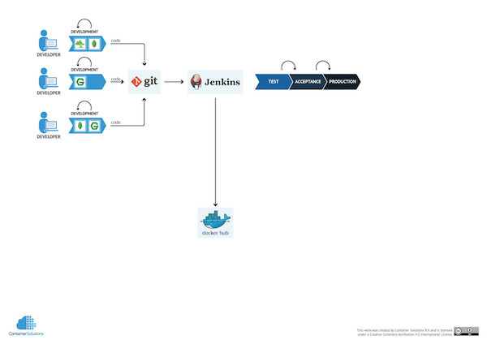

## CI/CD with Docker
We will create a simple CI/CD pipeline with Docker and Jenkins

At the end of this lesson, you will : 
* Run a private registry.
* Run Jenkins in Docker.
* Have a basic pipeline running.

----

## Setting up Continuous Integration



----

## Basic Application

Located in ./cicd/app.js

```js
// Load the http module to create an http server
var http = require('http');

// Configure our http server to respond
var server = http.createServer(function (request, response) {
  response.writeHead(200, {"Content-Type": "text/plain"});
  response.end("Hello world\n");
});

//Listen on port 8000
server.listen(8000);

//Put friendly message on the terminal
console.log("Server running at http://127.0.0.1:8000/");
```

----

./cicd/package.json

```json
{
  "name": "hello-world",
  "description": "hello-world",
  "version": "0.0.1",
  "private": true,
  "dependencies": {
    "express": "3.x"
  },
  "scripts": {"start": "node app.js"}
}
```

----

./cicd/Dockerfile.nodejs

```
FROM google/nodejs

WORKDIR /app
ADD package.json /app/
RUN npm install
ADD . /app

EXPOSE 8000
CMD []
ENTRYPOINT ["/nodejs/bin/npm", "start"]
```

----

### Build the Dockerimages

Check the Dockerfiles `Dockerfile.nodejs`and `Dockerfile.jenkins`

And build it
```
docker build -t my_nodejs_image -f Dockerfile.nodejs .
docker build -t containersol/jenkins_with_docker -f Dockerfile.jenkins .
docker run -d -p 8000:8000 my_nodejs_image
```
Open the nodejs app in a browser 
```
open http://172.17.9.102:8000
```

----

### Private registry and Jenkins
```
jenkins:
    image: containersol/jenkins_with_docker
    volumes:
        - jenkins-stuff:/var/jenkins_home/workspace/my_webapp
        - .:/var/jenkins_data
        - /var/run/docker.sock:/var/run/docker.sock
    ports:
        - "8081:9090"
    privileged: true
registry:
    image: registry
    environment:
        - STORAGE_PATH=/registry
    volumes:
        - registry-stuff:/registry
    ports:
        - "5000:5000"
```

----

### Start it

```
docker-compose up -d
```
Check the logs of the Jenkins container for the initial Password

----

### Access the Jenkins-UI 

Open a browser and access:
```
open http://<IP>:8081
```

Paste the initial passowrd in the UI and skip all the rest

----

### Start a new project "my_webapp"

Add to the section "Buildverfahren" three step to execute a shell command
First step:
```
./build.sh ${BUILD_ID}
```
Second step:
```
./push.sh ${BUILD_ID}
```
Third step:
```
./deploy.sh ${BUILD_ID}
```

----

### The scripts

build.sh
```bash
#!/bin/bash

if [ -z "${1}" ]; then
    version="latest"
else
    version="${1}"
fi

cd /var/jenkins_data/
docker build -t localhost:5000/containersol/my_nodejs_image:${version} -f Dockerfile.nodejs --no-cache .
cd ..
```

----

push.sh
```bash
#!/bin/bash

if [ -z "${1}" ]; then
    version="latest"
else
    version="${1}"
fi

docker push localhost:5000/containersol/my_nodejs_image:${version}
```

----

deploy.sh
```bash
#!/bin/bash

if [ -z "${1}" ]; then
    version="latest"
else
    version="${1}"
fi

docker ps -a | awk '{ print $1,$2 }' | grep my_nodejs_image | awk '{print $1 }' | xargs -I {} docker rm -f {}
docker run -d -p 8000:8000 localhost:5000/containersol/my_nodejs_image:${version}
```

----

### Make some changes and deploy them

Change something in `app.js` and build the Jenkins project. Refresh the browser and you'll see the changes.


----

## Summary

We've learned how to setup the poor-mans CI/CD pipeline using an own registry and Jenkins.