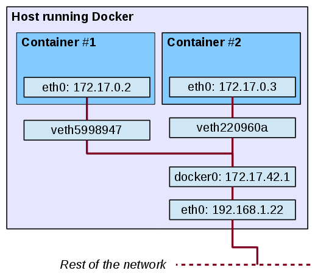

## Container networking basics
We will now run network services (accepting requests) in containers.

At the end of this lesson, you will be able to: 
* Run a network service in a container.
* Manipulate container networking basics.
* Find a container's IP address.

We will also explain the different network models used by Docker.

----

### Docker networking model

* Containers do not have a public IPv4 address
* They are allocated a private address
* Services running on a container must be exposed port by port
* Container ports have to be mapped to the host port to avoid conflicts

----

### The docker0 bridge

* When Docker starts, it creates a virtual interface called docker0 on the host machine
* docker0 is assigned a random IP address and subnet from the private range defined by RFC 1918
```
vagrant@vagrant-ubuntu-trusty-64:~$ ip a
…
…
3: docker0: <NO-CARRIER,BROADCAST,MULTICAST,UP> mtu 1500 qdisc noqueue state DOWN group default
    link/ether 56:84:7a:fe:97:99 brd ff:ff:ff:ff:ff:ff
    inet 172.17.42.1/16 scope global docker0
       valid_lft forever preferred_lft forever
    inet6 fe80::5484:7aff:fefe:9799/64 scope link
       valid_lft forever preferred_lft forever
```

----

### The docker0 bridge

* The docker0 interface is a virtual Ethernet bridge interface 
* It passes or switches packets between two connected devices just like a physical bridge or switch 
    * Host to container
    * Container to container
* Each new container gets one interface that is automatically attached to the docker0 bridge

----

### Checking the bridge interface

* We can use the brctl (bridge control) command to check the interfaces on our docker0 bridge
* You need to install it and it's just running on Linux. Therefore you need to install bridge-utils
Then:
```
vagrant@vagrant-ubuntu-trusty-64:~$ brctl show docker0
bridge name	bridge id		STP enabled	interfaces
docker0		8000.02421a4c0c64	no		 
```

----

### Checking the bridge interface

* Spin up some containers and then check the bridge again
```
vagrant@vagrant-ubuntu-trusty-64:~$ sudo docker run -dti alpine ping 8.8.8.8
55a6b1d032fdd577fe62f1b7091e0c44020f4148b3a98846b89c35bb185af15c
vagrant@vagrant-ubuntu-trusty-64:~$ brctl show docker0
bridge name	bridge id		STP enabled	interfaces
docker0		8000.02421a4c0c64	no		veth37ec123
							            veth970e976
```

----

### Check container interface

* Get into the container terminal and run the ip a command
```
vagrant@vagrant-ubuntu-trusty-64:~$ docker exec -ti 55a6b1d032fd sh
/ # ip a
1: lo: <LOOPBACK,UP,LOWER_UP> mtu 65536 qdisc noqueue state UNKNOWN 
    link/loopback 00:00:00:00:00:00 brd 00:00:00:00:00:00
    inet 127.0.0.1/8 scope host lo
       valid_lft forever preferred_lft forever
    inet6 ::1/128 scope host 
       valid_lft forever preferred_lft forever
15: eth0: <BROADCAST,MULTICAST,UP,LOWER_UP> mtu 1500 qdisc noqueue state UP 
    link/ether 02:42:ac:12:00:03 brd ff:ff:ff:ff:ff:ff
    inet 172.18.0.3/16 scope global eth0
       valid_lft forever preferred_lft forever
    inet6 fe80::42:acff:fe12:3/64 scope link 
       valid_lft forever preferred_lft forever
/ # 
```

----

### Check container networking properties

* Use docker inspect command and look for the NetworkSettings field 

```
   "NetworkSettings": {
            "Bridge": "",
            "SandboxID": "5dcf4708c3f0285bc587d1382f38cba83d16198909b293df9076617b601b2da8",
            "HairpinMode": false,
            "LinkLocalIPv6Address": "",
            "LinkLocalIPv6PrefixLen": 0,
            "Ports": {},
            "SandboxKey": "/var/run/docker/netns/5dcf4708c3f0",
            "SecondaryIPAddresses": null,
            "SecondaryIPv6Addresses": null,
            "EndpointID": "26d900529359bc307ba9e4a9bb5d5ac183f2f01dc96387896cd242dcf5a04f85",
            "Gateway": "172.18.0.1",
```

----

### Diagram of networking model



----

### Docker network command

* The docker network command and subcommands allow us to interact with Docker Networks and the containers in them
* Subcommands are:
```
docker network create
docker network connect
docker network ls
docker network rm
docker network disconnect
docker network inspect
```

----

### Default networks

* Docker comes with three networks automatically setup
* View the networks by using the docker network ls command
* The bridge network is the docker0 bridge
* By default all containers are connected to the bridge network
```
vagrant@vagrant-ubuntu-trusty-64:~$ docker network ls
NETWORK ID          NAME                DRIVER              SCOPE
69f3f12bba57        bridge              bridge              local               
6e1c02c2cdbc        host                host                local               
6d52ecd47b9b        none                null                local     
```

----

### Connecting to another network

* Containers can be launched on another network with the --net option in the docker run command
* Connecting the container to the none network will add it into its own network stack. The container will not have a network interface
* Connecting to the host network adds the container to the same network stack as the host
Launch an NGINX container on the host network
```
docker run –d --net=host nginx
```

----

### Inspecting a network

* Use the docker network inspect command to display the details of a particular network
* Will also show the containers connected to that network
```
vagrant@vagrant-ubuntu-trusty-64:~$ docker network inspect bridge
[
    {
        "Name": "bridge",
        "Id": "69f3f12bba573eb3ede5d955a16afbcbe47200024a27c6f0f11d29bc8346b7a9",
        "Scope": "local",
        "Driver": "bridge",
        "EnableIPv6": false,
        "IPAM": {
            "Driver": "default",
            "Options": null,
            "Config": [
                {
                    "Subnet": "172.18.0.0/16"
                }
            ]
        },
        "Internal": false,
        "Containers": {
            "22336eb6bd9d1b08f58906c0ad5ac01e3dd930a4349e0e0d10e3ab87f51ee31c": {
                "Name": "mad_torvalds",
```

----

### Do it yourselfe #1

* Make sure there are no existing containers running
```
docker stop $(docker ps -aq)
```
* Launch an Ubuntu container called container01 in detached mode
```
docker run --name=container01 -d –it bitnami:minideb
```
* Inspect the bridge network and note down the container IP address
```
docker network inspect bridge
```

----

* Launch another Ubuntu called ubuntu2 container and get terminal access inside
```
docker run --name=container02 -it bitnami/minideb /bin/bash
```
* Ping your ubuntu1 using the IP Address obtained in question 2.  
* Try and ping ubuntu1 using the container name. You will notice how it does not work
* Exit the container terminal without stopping it
```
CTRL + P + Q
```

----

### Creating your own network

* We can setup our own network for running our containers
* Use docker network create command
* Two types of networks we can create
    * Bridge
    * Overlay
* A bridge network is very similar to the docker0 network (the default bridge network we’ve seen)
* An Overlay network can span across multiple hosts

----

### Creating a bridge network

* Use the --driver option in docker network create and specify the bridge driver
Example:
```
vagrant@vagrant-ubuntu-trusty-64:~$ docker network create --driver bridge my_bridge
4b59706850b52630adc4a2453ce7f924eeb27224e6d682422506d416a2ac2ad5
vagrant@vagrant-ubuntu-trusty-64:~$ docker network ls
NETWORK ID          NAME                DRIVER              SCOPE
69f3f12bba57        bridge              bridge              local               
6e1c02c2cdbc        host                host                local               
4b59706850b5        my_bridge           bridge              local               
6d52ecd47b9b        none                null                local 
```

----

### Checking container network

* Inspect the container and look for the Networks field in the docker inspect output
* Should indicate the Network name, Gateway, IP Address etc…

```
docker run -d --net=my_bridge alpine ping 8.8.8.8
309536c231c2311823fafe74081f6445806fa9d2fcdbcc7ead478386b9bbdb62
vagrant@vagrant-ubuntu-trusty-64:~$ docker inspect 309536c231c2311823fafe74081f6445806fa9d2fcdbcc7ead478386b9bbdb62
...
"Networks": {
                "my_bridge": {
                    "IPAMConfig": null,
                    "Links": null,
                    "Aliases": [
                        "309536c231c2"
                    ],
                    "NetworkID": "4b59706850b52630adc4a2453ce7f924eeb27224e6d682422506d416a2ac2ad5",
                    "EndpointID": "db96dfd117ababd6016682c9162d7b4d2cdb8a8b391caa04be953ed4c2a82279",
                    "Gateway": "172.19.0.1",
                    "IPAddress": "172.19.0.2",
                    "IPPrefixLen": 16,
```

----

### Bridge network

* Containers must reside on the same host
* Containers in user defined bridge network can communicate with each other using their IP address and container name
    * Container must be launched with --name option

----

### Connecting containers to multiple networks

* Containers can be connected to multiple networks via the 
```
docker network connect
```
Command syntax
```
docker network connect [network name] [container name]
```

----

### Connecting containers to a network

We will create two named containers on this network.
First, let's create this container in the background.
```bash
docker run -dti --name con1 --net my_bridge alpine sh
```
Now, create another container in this network in the foreground.
```bash
docker run -ti --name con2 --net my_bridge alpine sh
```

----

### Communication between containers
From our new container con2, we can resolve and ping con1, using its assigned name:
```bash
ping -c4 con1
PING con1 (172.18.0.2): 56 data bytes
64 bytes from 172.18.0.2: seq=0 ttl=64 time=0.111 ms
64 bytes from 172.18.0.2: seq=1 ttl=64 time=0.098 ms
64 bytes from 172.18.0.2: seq=2 ttl=64 time=0.101 ms
64 bytes from 172.18.0.2: seq=3 ttl=64 time=0.130 ms

--- con1 ping statistics ---
4 packets transmitted, 4 packets received, 0% packet loss
round-trip min/avg/max = 0.098/0.110/0.130 ms
```

How does it work?

----

### Resolving container addresses

Before Docker Engine 1.10:
Docker updates `/etc/hosts` each time containers are added/removed.
```
172.18.0.2 con1
172.18.0.2 con1.my_bridge
```
After Docker Engine 1.10:
As of Docker 1.10, the docker daemon implements an embedded DNS server which provides built-in service discovery for any container created with a valid name or net-alias or aliased by link.

----

### Connecting to multiple networks

Let's create a new network and container in this network:
```bash
docker network create my_new_bridge
docker run -ti --name con3 --net my_new_bridge alpine sh
```
con3 can’t ping a container in a different network
```
ping -c4 con1
ping: bad address 'con1'
```

----

You need to connect the container to the new network:
```bash
docker network connect my_bridge con3

docker attach con3
/ # ping -c1 con1
PING con1 (172.18.0.2): 56 data bytes
64 bytes from 172.18.0.2: seq=0 ttl=64 time=0.104 ms

--- con1 ping statistics ---
1 packets transmitted, 1 packets received, 0% packet loss
round-trip min/avg/max = 0.104/0.104/0.104 ms
```

----

### Exposing a container in a bridge network
* Containers running in a bridge network can only be accessed by the host in which that network resides
* To make a container accessible to the outside we must expose the container ports and map them to a port on the host. 
* The container can be accessed via the mapped host port

----

### Mapping ports

* Map exposed container ports to ports on the host machine
* Ports can be manually mapped or auto mapped
* You can see the port mapping for each container on the docker ps output

----

### Manual allocation of ports
If you want to set port numbers yourself, no problem:
```bash
docker run -d -p 80:80 nginx
docker run -d -p 8000:80 nginx
```

* We are running two NGINX web servers.
* The first one is exposed on port 80.
* The second one is exposed on port 8000.

Note: the convention is port-on-host:port-on-container

----

### Automatic allocation of ports

* Use the -P option in docker run command
* Automatically maps exposed ports in the container to a port number in the host
* Host port numbers used go from 49153 to 65535
* Only works for ports defined in the Dockerfile EXPOSE instruction
```
docker run –d –P nginx
```

----

### EXPOSE instruction

* Configures which ports a container will listen on at runtime
* Ports still need to be mapped when container is executed

```
FROM ubuntu:14.04
RUN apt-get update
RUN apt-get install -y nginx

EXPOSE 80 443

CMD ["nginx", "-g", "daemon off;"]
```

----

### Module summary

* Docker containers run in a subnet provisioned by the docker0 bridge on the host machine
* We can create our own bridge or overlay network to run containers on
* Auto mapping of container ports to host ports only applies to the port numbers defined in the Dockerfile EXPOSE instruction
* Key Dockerfile instructions
```
EXPOSE
```

----